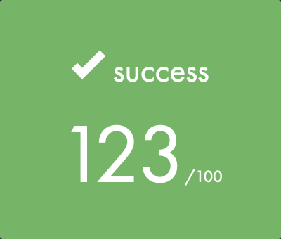
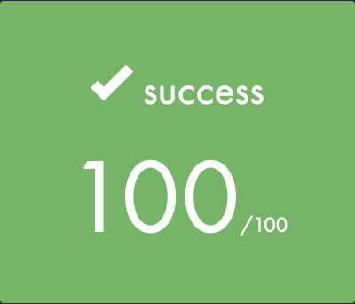
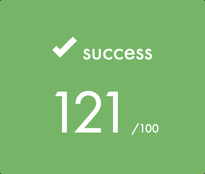
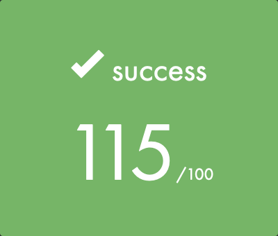
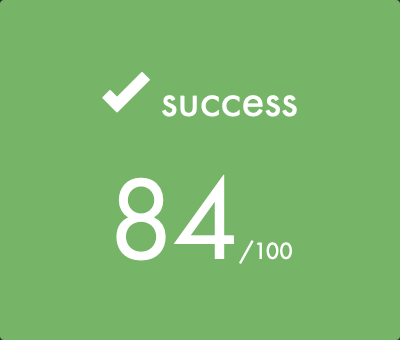

# 42_Cursus

This repo countains all the projects I did throughout my cursus in the school 42 Lausanne. I started the school in October 2021 and I currently am working on the "philosophers" project.
You can click on some of the projects I found worth sharing to see the code associated to them.

# Projects

| Projects 				| 				Result |
| --------------------- | ---------------------- |
| Libft |  |
| Printf |  |
| [Born2BeRoot](https://www.notion.so/Virtualisation-1d61bf3afab04cc9aaf5a51107382f0f) |  |
| [Get_Next_Line]() |  |
| [So_Long](https://github.com/victorvermot/so_long) |  |
| [Minitalk](https://github.com/victorvermot/minitalk) |  |
| [Push_Swap](https://github.com/victorvermot/push_swap) |  |
